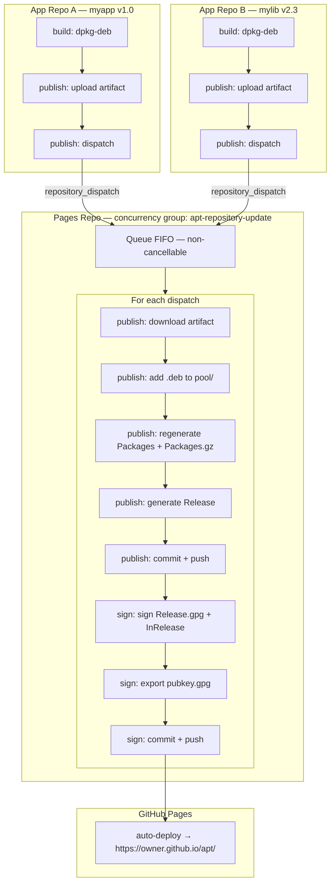
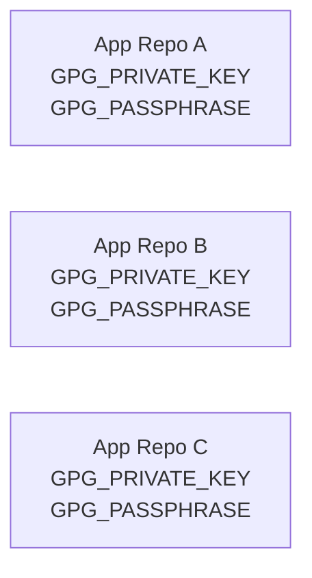
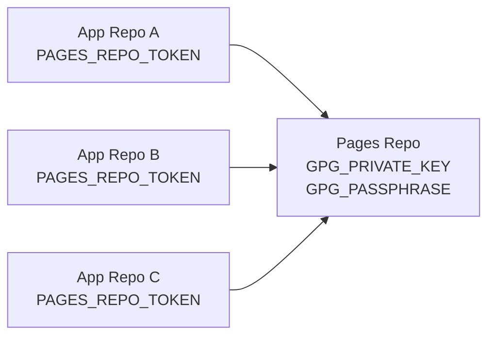
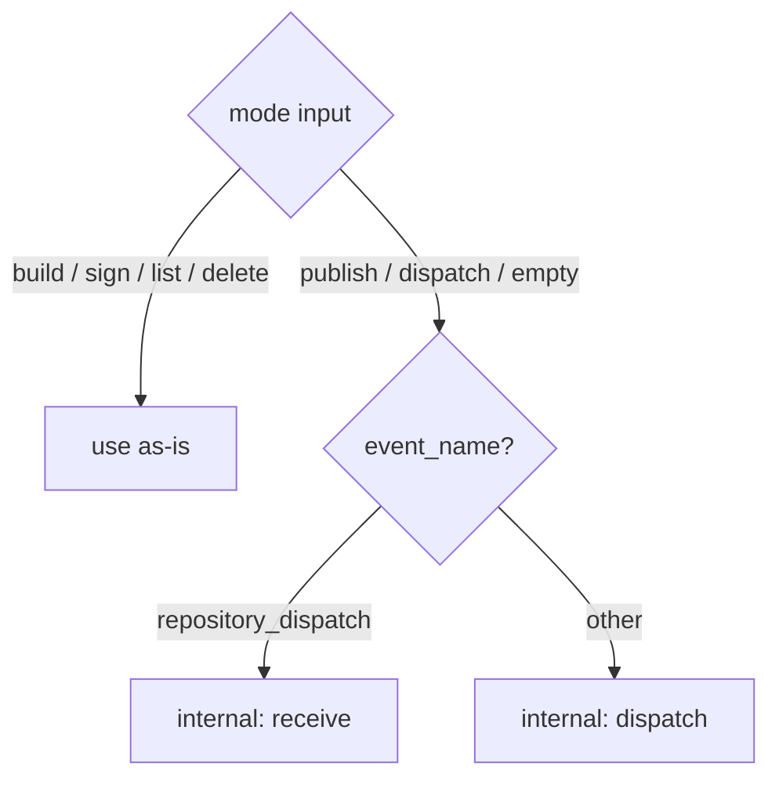

# Architecture Overview

## Problem Statement

The original v1 approach had critical flaws:

1. **Race Conditions**: Multiple repos could simultaneously modify the pages repo, causing:
   - Metadata corruption (Packages, Release files)
   - Lost updates (last writer wins)
   - Inconsistent GPG state

2. **GPG Inconsistency**: If one repo signs and another doesn't:
   - Unsigned push can clobber signed repo
   - Clients get signature warnings/errors
   - No single source of truth for keys

3. **Security**: GPG keys duplicated across all app repos

4. **Inefficiency**: Every push downloads entire pages repo, rebuilds everything

## Solution: Five-Mode Architecture

### Mode overview

| Mode | Runs in | Purpose |
|------|---------|---------|
| `build` | App repo | Build a `.deb` from a source directory |
| `publish` | App repo (dispatch) or Pages repo (receive) | Upload + trigger, or download + update APT index |
| `sign` | Pages repo | GPG-sign the APT repository after publish or delete |
| `list` | Pages repo | Inspect all packages and versions |
| `delete` | Pages repo | Remove a package version and regenerate the index |

### Mode detail

**`build`** (app repos)
- Validates `DEBIAN/control` exists
- Runs `dpkg-deb --build` and outputs the `.deb` path

**`publish` — dispatch side** (app repos)
- Extracts package metadata from `.deb`
- Uploads `.deb` as a 1-day GitHub artifact
- Sends `repository_dispatch` event with artifact coordinates

**`publish` — receive side** (pages repo, auto-detected on `repository_dispatch`)
- Downloads the artifact from the source repo
- Copies `.deb` to `pool/`
- Regenerates `Packages` + `Packages.gz` indexes
- Generates `Release` file
- Commits and pushes

**`sign`** (pages repo, called after `publish` or `delete`)
- Signs `Release` → `Release.gpg` + `InRelease`
- Exports `pubkey.gpg`
- Commits and pushes

**`list`** (pages repo, manual)
- Checkouts repo
- Scans pool and Packages indexes
- Renders a markdown summary in the workflow summary page

**`delete`** (pages repo, manual)
- Removes matching `.deb` files from `pool/`
- Regenerates `Packages` + `Release` for the affected distribution
- Commits and pushes

### Key Benefits

✅ **Sequential Processing**: `concurrency` key ensures one-at-a-time execution  
✅ **Single GPG Source**: Keys stored only in pages repo secrets  
✅ **No Race Conditions**: Queue-based processing prevents conflicts  
✅ **Separation of Concerns**: Publishing and signing are independent steps  
✅ **Decoupled**: App repos don't need pages repo access  
✅ **Scalable**: Any number of app repos can publish  

### Flow Diagram



## Implementation Details

### Concurrency Control

In the pages repo workflow:

```yaml
concurrency:
  group: apt-repository-update
  cancel-in-progress: false  # CRITICAL: Queue instead of cancel
```

This ensures:
- Only one workflow runs at a time
- Pending runs wait in queue
- No lost publications
- Consistent repository state

### Artifact Transfer

Instead of pushing `.deb` files to pages repo directly:

1. **App repo**: Upload as artifact (1-day retention)
2. **Dispatch event**: Send artifact metadata
3. **Pages repo**: Download artifact using `gh run download`

Benefits:
- No need for app repos to have pages repo write access
- Cleaner git history (no .deb files in commits)
- Faster checkout (no large binary history)

### GPG Key Management

**Before (v1):**



**After (v2):**



Benefits:
- Single key rotation point
- Consistent signing
- Better secret hygiene

### Mode Auto-Detection



Explicit mode setting is always recommended for clarity:

```yaml
with:
  mode: publish  # never ambiguous
```

## Security Considerations

### Token Permissions

**`PAGES_REPO_TOKEN` (in app repos):**
- Scope: Only pages repo
- Permission: Contents (Read + Write)
- Used for: Sending repository_dispatch + Downloading artifacts

**`GITHUB_TOKEN` (in pages repo workflow):**
- Automatic token
- Permission: Default (Read + Write contents)
- Used for: Downloading artifacts, checking out, pushing

### GPG Key Security

- Stored only in pages repo secrets
- Never leaves GitHub secrets
- Automatically cleaned from runner after use
- Passphrase-protected recommended

## Failure Modes & Recovery

### App Repo Failure
- **Where**: During build or dispatch
- **Impact**: Only that app's package fails
- **Recovery**: Retry workflow or push new commit

### Pages Repo Failure
- **Where**: During publish
- **Impact**: That package not published, queue stalls
- **State**: Repository remains consistent (no partial updates)
- **Recovery**: Fix issue, re-run failed workflow

### Concurrent Dispatch Handling
- **Scenario**: Multiple repos dispatch simultaneously
- **Behavior**: All queued sequentially
- **Result**: All packages published in order

### Artifact Expiration
- **Retention**: 1 day
- **Mitigation**: Publish workflow should run immediately
- **Recovery**: Retrigger app workflow if artifact expired

## Performance

### Before (v1)

```mermaid
gantt
    title Per publish (v1) — with conflicts
    dateFormat s
    axisFormat %Ss

    Checkout pages repo   : 0, 5s
    Process package       : 5s, 3s
    Sign                  : 8s, 2s
    Push (with retries)   : 10s, 10s
```

Concurrent publishes: conflicts, retries, race conditions.

### After (v2)

```mermaid
gantt
    title App repo side (non-blocking)
    dateFormat s
    axisFormat %Ss

    Upload artifact : 0, 2s
    Send dispatch   : 2s, 1s
```

```mermaid
gantt
    title Pages repo side — per queue item (v2)
    dateFormat s
    axisFormat %Ss

    Download artifact    : 0, 2s
    Checkout pages repo  : 2s, 3s
    Process package      : 5s, 3s
    Commit + push        : 8s, 2s
    Sign (separate step) : 10s, 2s
    Sign commit + push   : 12s, 2s
```

Concurrent publishes: queued, no conflicts.

## Migration Path

1. Add pages repo workflows: `publish-deb.yml`, `list-packages.yml`, `delete-package.yml` (from `example/workflows/`)
2. Update app repo workflows to use `mode: build` + `mode: publish`
3. Move `GPG_PRIVATE_KEY` / `GPG_PASSPHRASE` secrets to pages repo
4. Test with one app repo
5. Migrate remaining app repos
6. Remove old workflows

## Future Enhancements

- [ ] Webhook notifications on publish completion
- [ ] Publish status badges
- [ ] Multi-architecture support in single dispatch
- [ ] Artifact caching for faster re-publishes
- [ ] Repository statistics generation
- [ ] Custom post-publish hooks
