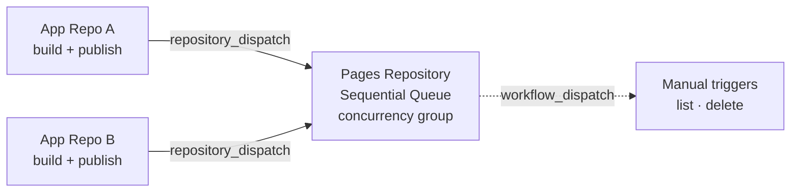

# deb-publish

A GitHub Action for building, publishing, listing, and managing `.deb` packages in APT repositories hosted on GitHub Pages with **proper concurrency control**.

## Why This Architecture?

✅ **No race conditions** — Sequential processing in the pages repo prevents concurrent metadata corruption  
✅ **No secret sprawl** — GPG keys are stored only in the pages repo  
✅ **Consistent signing** — Every publish is signed from a single source of truth  
✅ **Transactional updates** — Repository stays consistent even during failures  

## How It Works

**Five modes, one action:**

| Mode | Where it runs | What it does |
|------|---------------|--------------|
| `build` | App repo | Build a `.deb` from a source directory |
| `publish` | App repo | Upload artifact + dispatch to pages repo (auto-detected) |
| `publish` | Pages repo | Receive artifact + update APT index (auto-detected via `repository_dispatch`) |
| `sign` | Pages repo | GPG-sign the repository |
| `list` | Pages repo | Inspect all distributions, packages, and versions |
| `delete` | Pages repo | Remove a package version and regenerate the APT index |



---

## Table of contents

1. [Quick Start](#quick-start)
2. [Prerequisites](#prerequisites)
3. [Setup](#setup)
   - [Step 1: Pages repository](#step-1-pages-repository)
   - [Step 2: App repositories](#step-2-app-repositories)
4. [Client setup](#client-setup)
5. [Repository management](#repository-management)
6. [Inputs Reference](#inputs-reference)
7. [Outputs Reference](#outputs-reference)
8. [Advanced Usage](#advanced-usage)

---

## Quick Start

**Pages repository** (`owner.github.io`) — copy the entire `setup/workflows/` directory into `.github/workflows/`:

```
setup/workflows/
  publish-deb.yml     ← triggered automatically on each dispatch
  list-packages.yml   ← manual: inspect the repository
  delete-package.yml  ← manual: remove a package version
```

**App repositories** — copy `setup/app-repo-workflow.yml` into `.github/workflows/release.yml` and adapt it to your build.

---

## Prerequisites

### GitHub Pages repository

You need a repository with GitHub Pages enabled. The most common choice is `owner.github.io`.

1. Go to <https://github.com/new>
2. Name it `owner.github.io` (user pages) or any name (project pages)
3. Set to **Public** (required for free Pages)
4. Initialize with README → Create

Then enable Pages: **Settings → Pages → Source: Deploy from a branch** → select branch + `/ root`.

### Create a Personal Access Token

The dispatch step needs permission to trigger workflows in your pages repo.

1. Go to <https://github.com/settings/personal-access-tokens/new>
2. **Name:** `deb-publish-dispatch`
3. **Repository access:** Only select repositories → your pages repo
4. **Permissions → Repository → Contents:** Read and write
5. Generate and copy the token

### Generate a GPG signing key

Signing is optional but strongly recommended.

```bash
gpg --batch --gen-key <<EOF
Key-Type: RSA
Key-Length: 4096
Name-Real: APT Repository Signing Key
Name-Email: apt@yourdomain.com
Expire-Date: 2y
Passphrase: your-secure-passphrase
%commit
EOF

# Find your key ID
gpg --list-secret-keys --keyid-format LONG

# Export private key (goes into secrets)
gpg --armor --export-secret-keys KEY_ID
```

### Add secrets

**In your pages repository** (`owner.github.io`):

| Secret | Value |
|--------|-------|
| `GPG_PRIVATE_KEY` | Full ASCII-armored private key |
| `GPG_PASSPHRASE` | Passphrase (leave empty if none) |

**In each app repository**:

| Secret | Value |
|--------|-------|
| `PAGES_REPO_TOKEN` | Fine-grained PAT from the step above |

---

## Setup

### Step 1: Pages repository

Copy the entire `setup/workflows/` directory into `.github/workflows/` of your pages repository:

```
setup/workflows/publish-deb.yml     → .github/workflows/publish-deb.yml
setup/workflows/list-packages.yml   → .github/workflows/list-packages.yml
setup/workflows/delete-package.yml  → .github/workflows/delete-package.yml
```

No edits required — commit and push.

### Step 2: App repositories

Copy `setup/app-repo-workflow.yml` into `.github/workflows/release.yml` of each app repository and adapt it:

- Replace the build step with your actual build process
- Set `pages-repo` to your pages repository (`owner/owner.github.io`)

Then commit, push a `v*` tag, and the pipeline runs automatically.

---

## Client setup

After your first package is published, users install from your APT repository:

```bash
# Add GPG key
curl -fsSL https://your-org.github.io/apt/pubkey.gpg | sudo gpg --dearmor -o /etc/apt/trusted.gpg.d/your-repo.gpg

# Add repository
echo "deb [arch=amd64] https://your-org.github.io/apt stable main" | sudo tee /etc/apt/sources.list.d/your-repo.list

# Install
sudo apt update
sudo apt install your-package-name
```

For unsigned repositories:

```bash
echo "deb [arch=amd64 trusted=yes] https://your-org.github.io/apt stable main" | sudo tee /etc/apt/sources.list.d/your-repo.list
```

---

## Repository management

### List packages

Run **Actions → List APT Repository Contents → Run workflow** in your pages repo.

| Input | Description | Default |
|-------|-------------|---------|
| `deb-dir` | APT repository directory | `apt` |
| `distribution` | Filter by distribution (leave empty for all) | *(all)* |

Results are rendered as a markdown table in the workflow summary.

### Delete a package

Run **Actions → Delete Package from APT Repository → Run workflow** in your pages repo.

| Input | Description | Default |
|-------|-------------|---------|
| `package-name` | Package name (e.g. `myapp`) | *(required)* |
| `version` | Version to delete — leave empty to delete all | *(all)* |
| `distribution` | Distribution to regenerate | `stable` |
| `component` | Component to regenerate | `main` |
| `deb-dir` | APT repository directory | `apt` |
| `dry-run` | Preview without applying | `false` |

> Use `dry-run: true` first to verify what will be deleted.

The delete workflow shares the `apt-repository-update` concurrency group with publish, so it never conflicts with an in-flight publication.

---

## Inputs Reference

### Common inputs

| Input | Description | Default |
|-------|-------------|---------|
| `mode` | `build`, `publish`, `sign`, `list`, or `delete` (auto-detected if empty) | *(auto)* |
| `pages-branch` | Branch of the pages repository | `master` |
| `deb-dir` | APT repository subdirectory in the pages repo | `apt` |
| `distribution` | APT distribution | `stable` |
| `component` | APT component | `main` |

### `build` mode

| Input | Description | Default |
|-------|-------------|---------|
| `package-dir` | Directory containing `DEBIAN/control` and the package file tree | `package` |
| `output-path` | Output path for the generated `.deb` | `package.deb` |

### `publish` mode — app repo side

| Input | Description | Required |
|-------|-------------|----------|
| `deb-path` | Path to `.deb` file | Yes |
| `token` | GitHub token with `repository_dispatch` permission on the pages repo | Yes |
| `pages-repo` | Pages repository (`owner/repo`) | Yes |

### `sign` mode

| Input | Description | Required |
|-------|-------------|----------|
| `gpg-private-key` | ASCII-armored GPG private key | Yes |
| `gpg-passphrase` | Passphrase for the GPG private key | No |
| `distribution` | Distribution whose Release file to sign | No |

### `delete` mode

| Input | Description | Default |
|-------|-------------|---------|
| `package-name` | Package to delete | *(required)* |
| `version` | Version to delete — leave empty to delete all versions | *(all)* |
| `dry-run` | Preview without applying | `false` |

---

## Outputs Reference

| Output | Description | Mode |
|--------|-------------|------|
| `mode` | Effective internal mode: `build` · `dispatch` · `receive` · `sign` · `list` · `delete` | All |
| `deb-path` | Path to the generated `.deb` file | `build` |
| `package-name` | Package name | `build`, `publish` |
| `package-version` | Package version | `build`, `publish` |
| `package-arch` | Package architecture | `build`, `publish` |
| `dispatched` | Whether the dispatch was sent successfully | `publish` (app side) |
| `deleted-count` | Number of `.deb` files removed from the pool | `delete` |

---

## Advanced Usage

### Multiple architectures

Use a matrix in your app repo workflow:

```yaml
strategy:
  matrix:
    include:
      - goarch: amd64
        debarch: amd64
      - goarch: arm64
        debarch: arm64
      - goarch: arm
        debarch: armhf
        goarm: "7"
```

### Multiple distributions

Dispatch to several distributions from the same workflow:

```yaml
- uses: Vr00mm/deb-publish@v2
  with:
    deb-path: myapp.deb
    token: ${{ secrets.PAGES_REPO_TOKEN }}
    pages-repo: your-org/your-org.github.io
    distribution: stable

- uses: Vr00mm/deb-publish@v2
  with:
    deb-path: myapp.deb
    token: ${{ secrets.PAGES_REPO_TOKEN }}
    pages-repo: your-org/your-org.github.io
    distribution: jammy
```

### Version from git tag

```bash
VERSION=${GITHUB_REF_NAME#v}  # v1.2.3 → 1.2.3
sed -i "s/^Version:.*/Version: $VERSION/" package/DEBIAN/control
```

All versions are preserved in `pool/`. Users can pin to a specific version:

```bash
sudo apt install mypackage=1.2.3
```

---

## Troubleshooting

### Dispatch fails with 403

- Ensure `PAGES_REPO_TOKEN` has **Contents: Read and write** permission on the pages repo
- Verify the token hasn't expired

### GPG signature errors

- Verify `GPG_PRIVATE_KEY` includes the full header/footer (`-----BEGIN/END PGP PRIVATE KEY BLOCK-----`)
- Check the passphrase matches the key
- Check the key hasn't expired: `gpg --list-keys`

### Packages not appearing after publish

- Check the GitHub Pages deployment status (Actions tab → pages-build-deployment)
- Wait 1–2 minutes for Pages to deploy after the push
- Verify `deb-dir` is the same in both the app and pages workflows

### Concurrent publishes not queuing

- Ensure `concurrency.group: apt-repository-update` is set in the pages workflow
- Ensure `cancel-in-progress: false` (not `true`)

---

## Migration from v1

1. **Pages repo**: Copy `setup/workflows/` into `.github/workflows/` — add `GPG_PRIVATE_KEY` and `GPG_PASSPHRASE` secrets here
2. **App repos**: Replace `Vr00mm/deb-publish@v1` with `@v2`, remove `pages-url`, `gpg-private-key`, `gpg-passphrase`

---

## License

MIT
